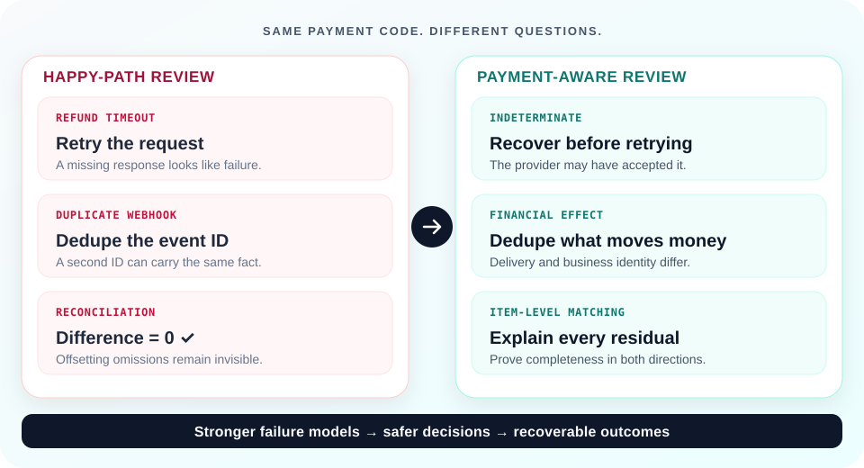
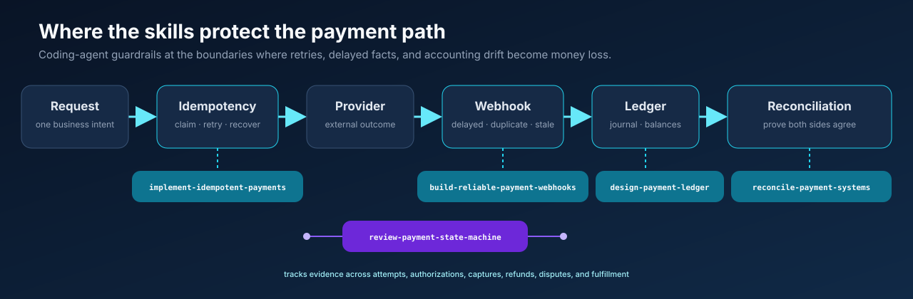

<h1 align="center">Payments Engineering Skills</h1>

<p align="center"><strong>Make Claude Code and OpenAI Codex review payment code like real money can be lost.</strong></p>

<p align="center">
  A timeout does not prove failure. Delivery order is not payment truth.<br>
  Matching totals do not prove reconciliation.
</p>

<p align="center">
  Source-backed review guardrails for backend and fintech engineers using AI coding agents on refunds, ledgers, webhooks, reconciliation jobs, and payment state machines.
</p>

<p align="center">
  <a href="https://github.com/Pablo-aps/payments-engineering-skills/actions/workflows/ci.yml"></a>
  <a href="https://agentskills.io/"></a>
  <a href="LICENSE"></a>
</p>

<p align="center">
  <a href="#install-with-one-command"><strong>Install</strong></a> ·
  <a href="#five-failures-generic-reviews-miss">See the failure modes</a> ·
  <a href="#evidence-not-vibes">Inspect the evidence</a>
</p>

<p align="center"><sub>5 focused skills · 50 named hazards · 65 evals · 20 executable fixtures</sub></p>

<p align="center">
  <picture>
    <source media="(prefers-color-scheme: dark) and (max-width: 600px)" srcset="docs/readme-hero-mobile-dark.svg">
    <source media="(prefers-color-scheme: light) and (max-width: 600px)" srcset="docs/readme-hero-mobile-light.svg">
    <source media="(prefers-color-scheme: dark)" srcset="docs/readme-hero-dark.svg">
    <source media="(prefers-color-scheme: light)" srcset="docs/readme-hero-light.svg">
    
  </picture>
</p>

## Install with one command

Run this from your project root to install all five skills for both Codex and Claude Code:

```bash
npx skills add Pablo-aps/payments-engineering-skills \
  --agent codex claude-code \
  --skill '*' \
  --yes \
  --copy
```

The command copies the skills into `.agents/skills` and `.claude/skills` and records their source in `skills-lock.json`. Review and commit those project-scoped files so every engineer and agent uses the same version. The command has been verified in a clean Git repository with the current [Skills CLI](https://github.com/vercel-labs/skills).

Then ask for a focused review:

```text
Use $implement-idempotent-payments to review this refund endpoint. Assume the
provider can time out after accepting the request and two API instances may race.
```

Claude Code uses the same skill as `/implement-idempotent-payments`.

<details>
<summary><strong>Manual install without the Skills CLI</strong></summary>

```bash
git clone --depth 1 https://github.com/Pablo-aps/payments-engineering-skills.git
mkdir -p .agents/skills .claude/skills
cp -R payments-engineering-skills/skills/* .agents/skills/
cp -R payments-engineering-skills/skills/* .claude/skills/
```

Codex discovers repository skills in `.agents/skills`; Claude Code uses `.claude/skills`. See the official [Codex skills](https://developers.openai.com/codex/skills) and [Claude Code skills](https://code.claude.com/docs/en/skills) documentation for user-level installation and discovery behavior.

</details>

## Install this before your agent touches money

> [!IMPORTANT]
> Use these guardrails whenever generated code can decide whether money moved, how much is available, or which financial fact is authoritative.

This repository is for you when Claude Code or Codex can change code that:

- creates, captures, refunds, pays out, or transfers money;
- calculates an available balance or posts ledger entries;
- consumes provider webhooks or asynchronous payment events;
- retries a mutation after a timeout or connection failure;
- decides whether two financial systems have reconciled;
- changes payment, refund, payout, dispute, or fulfillment state.

If your agent only works on checkout UI, pricing pages, or non-financial API glue, you probably do not need these skills.

## Five failures generic reviews miss

| Failure | Happy-path answer | Payment-aware guardrail |
| --- | --- | --- |
| [Refund response timed out](examples/ambiguous-refund-timeout.md) | Retry, often with a fresh key | Preserve one operation and provider key, move to `INDETERMINATE`, and recover from authoritative evidence before another mutation |
| [Two withdrawals race](examples/concurrent-withdrawal.md) | Wrap each request in a transaction | Serialize the debit decision and journal posting at the database boundary; prove both workers cannot spend the same balance |
| [Webhook arrives twice or late](examples/duplicate-webhook.md) | Deduplicate the event ID | Separate delivery identity, provider fact, and financial-effect identity; durably accept and guard stale transitions |
| [Provider and ledger totals match](examples/aggregate-reconciliation.md) | Declare the day reconciled | Prove source completeness, deduplicate both populations, match in both directions, and explain every residual |
| [A late attempt succeeds after a retry](examples/stale-payment-event.md) | Overwrite the order status | Model attempts and captures separately, preserve contradictory evidence, detect excess payment, and gate fulfillment idempotently |

These are distributed-systems failures with accounting consequences. “Use idempotency,” “wrap it in a transaction,” and “verify the webhook” are starting points, not sufficient controls.

## See the difference

The published directional smoke benchmark gave Codex the same five unsafe payment artifacts and prompts, first without project skills and then with only the relevant skill installed.

| Case | Baseline | With skill | Signal added in this run |
| --- | ---: | ---: | --- |
| Ambiguous refund timeout | 3/4 | 4/4 | Test timeout → late provider success → exactly one refund |
| Duplicate webhook | 4/4 | 4/4 | No delta; the baseline already found all four required signals |
| Concurrent withdrawal | 3/4 | 4/4 | Require an immutable balanced journal, not mutable balance-only history |
| Aggregate reconciliation | 2/4 | 4/4 | Reject aggregate equality and require bidirectional item-level matching |
| Stale payment event | 3/4 | 4/4 | Separate commercial intent, provider attempts, captures, and fulfillment |
| **Observed total** | **15/20** | **20/20** | **+5 required signals** |

> [!NOTE]
> This is one trial per cell, not a statistically significant model comparison or a claim that generated code is safe. Pattern checks only show whether predeclared concepts appeared. Read the [method](benchmark/README.md), [scored report](benchmark/results/2026-08-18.codex.md), and complete [structured outputs](benchmark/results/2026-08-18.codex.raw.json) together.

## Choose the right guardrail

| Skill | Bring it in when… | It refuses to hand-wave… |
| --- | --- | --- |
| [`implement-idempotent-payments`](skills/implement-idempotent-payments/SKILL.md) | A financial mutation can be retried, raced, timed out, or replayed | Stable intent and provider keys, ambiguous outcomes, retention expiry, failover, and duplicate downstream effects |
| [`build-reliable-payment-webhooks`](skills/build-reliable-payment-webhooks/SKILL.md) | A provider delivers signed facts asynchronously | Exact-byte verification, durable acceptance, semantic duplicates, reordering, replay, queue gaps, and secret rotation |
| [`design-payment-ledger`](skills/design-payment-ledger/SKILL.md) | Code changes balances, holds, fees, transfers, or financial history | Double entry, ownership and asset dimensions, concurrency, reversals, stale projections, backdating, and hot accounts |
| [`reconcile-payment-systems`](skills/reconcile-payment-systems/SKILL.md) | Internal records must agree with provider, settlement, payout, or bank data | Source completeness, corrected files, date bases, matching both directions, exception aging, and safe adjustments |
| [`review-payment-state-machine`](skills/review-payment-state-machine/SKILL.md) | One status tries to represent authorizations, captures, refunds, disputes, or multiple attempts | Evidence precedence, partial operations, amount races, late success, contradictory facts, and fulfillment gates |

Each directory follows the open [Agent Skills](https://agentskills.io/) format and contains a focused `SKILL.md`, a machine-readable hazard catalog, primary-source references, and an adaptable SQL or YAML contract.

## How the guardrails fit together



No single component provides exactly-once money movement. The skills overlap intentionally at boundaries where a response, event, posting, or report can be lost, duplicated, delayed, or misclassified.

## Evidence, not vibes

The repository currently encodes 50 named failure mechanisms. For every applicable critical hazard, the agent must provide concrete evidence for:

```text
prevention | detection | recovery | failure test
```

The proof surface is inspectable:

- 65 trigger, positive, negative, adversarial, and artifact-review eval cases;
- 20 deterministic failure fixtures with explicit expected outcomes;
- five compact educational cases linked to primary documentation;
- executable PostgreSQL contract tests;
- an isolated before/after protocol with fixed criteria, fingerprints, raw outputs, tool versions, and limitations.

The details are deliberately uncomfortable: provider keys scoped by region, idempotency records expiring before disaster replay, valid-but-replayed webhook payloads, two event IDs for one financial fact, balanced entries posted to the wrong owner, corrected settlement files counted twice, and two payment attempts that both succeed.

A useful review should return named invariants, stable operation identities, transaction boundaries, an explicit uncertainty model, provider-specific assumptions, observability and recovery ownership, and tests that force dangerous timing. It should not merely repeat the happy path.

The core rules are:

1. Never infer non-execution from a timeout or an early not-found response.
2. Never treat an HTTP request, webhook delivery, and financial effect as the same identity.
3. Never use mutable balances or provider objects as an internal journal.
4. Never pass reconciliation before proving source completeness and item-level coverage.
5. Never overwrite stronger financial evidence because a stale event arrived later.
6. Reverse or adjust posted financial history; do not rewrite it.

<details>
<summary><strong>Validate the repository and inspect its layout</strong></summary>

Node.js 20 or newer is sufficient. The repository has no runtime dependencies.

```bash
npm test
```

The validator fails if a skill loses its catalog, a hazard loses eval coverage, a fixture points to the wrong skill, required metadata drifts, or a PostgreSQL contract violates its executable invariants.

```text
skills/       Agent Skills, hazard catalogs, references, and contracts
examples/     Compact source-backed payment failure cases
benchmark/    Isolated Codex and Claude Code before/after protocol
evals/        Trigger and failure-mode evaluation cases
fixtures/     Deterministic implementation scenarios
scripts/      Dependency-free repository validation
test/         Repository, fixture, and PostgreSQL contract tests
```

</details>

## Frequently asked questions

<details>
<summary><strong>Are these skills specific to Stripe?</strong></summary>

No. The failure mechanisms are vendor-neutral, but provider guarantees are not. The skills require the agent to verify the exact Stripe, Adyen, PayPal, bank, crypto rail, or internal-provider contract instead of generalizing one provider's behavior to another.

</details>

<details>
<summary><strong>Can I install only one skill?</strong></summary>

Yes. Replace `'*'` with the skill name:

```bash
npx skills add Pablo-aps/payments-engineering-skills \
  --agent codex claude-code \
  --skill implement-idempotent-payments \
  --yes \
  --copy
```

</details>

<details>
<summary><strong>Do these skills make generated payment code safe?</strong></summary>

No. They make failure analysis more specific, reviewable, and testable. They do not replace provider documentation, production testing, security review, accounting policy, compliance, legal review, or accountable engineering judgment.

</details>

## Scope and safety

These are engineering guardrails, not a payment processor, compliance certification, or substitute for accountable security, finance, compliance, and legal review. Before adapting a contract, decide tenancy, access control, privacy, currency scale, retention, provider guarantees, regulatory boundary, availability target, and operational ownership.

See [SECURITY.md](SECURITY.md) for private vulnerability reporting and [CONTRIBUTING.md](CONTRIBUTING.md) for the evidence standard.

## License

Apache License 2.0. See [LICENSE](LICENSE).
